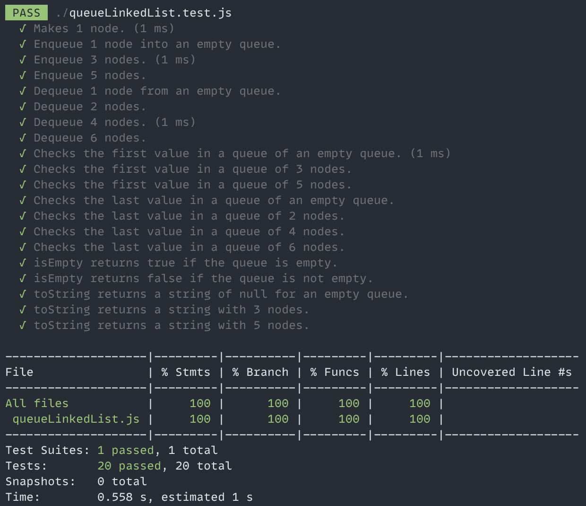

# JEST Collection of Projects

This folder contains a collection of mini projects along with its unit tests written using JEST.

## The Calculator Project

The Calculator project contains the following methods:

- add
- subtract
- multiply
- divide

## The Stack API Project

The Stack API project contains the following methods:

- push
- pop
- top
- isEmpty
- print

## The NodeList API Project 

The nodeList API project contains the following methods:

- add
- contains
- plainList
- remove
- reverse

## The Queue API Project

The queue API project contains the following methods:

- enqueue: pushes a value into the queue
- dequeue: removes the first value from the queue
- firstValueInQueue: returns the first value in the queue
- lastValueInQueue: returns the last value in the queue
- isEmpty: returns a boolean of whether the queue is empty
- printValuesInQueue: prints all the values in the queue

## The Stacked Linked List API Project

The Stacked Linked List API project uses nodes to implement the following methods:

- push: pushes a node to the Stack and sets the next node.
- pop: pops a node from the Stack.
- isTop: returns the value of the top of the Stack.
- isEmpty: returns a boolean of whether the Stack is empty.
- toString: returns a string of all the values in the Stack.

# The Queue Linked List Project

The Queue Linked List API project implements a linked list queue API. The Queue class uses a linked list of nodes to implement the following methods:

- enqueue: adds a node to the end of the queue.
- dequeue: removes a node from the front of the queue.
- firstValueInQueue: returns the first value in the queue.
- lastValueInQueue: returns the last value in the queue.
- isEmpty: returns a boolean if the queue is empty.
- toString: returns a string of the values in the queue.

