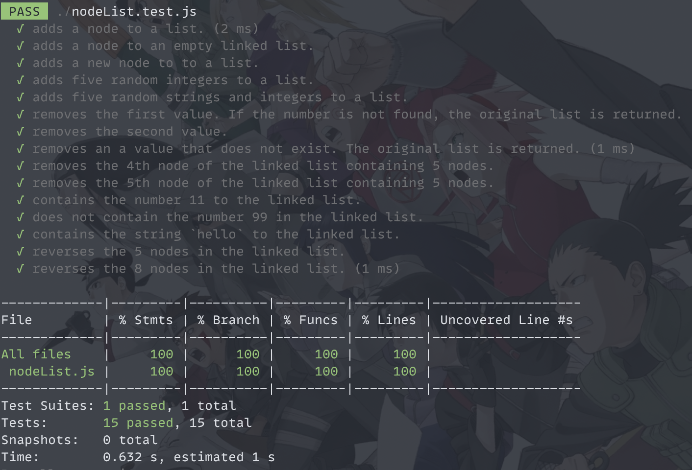

The nodeList API project contains the following functions along with its respective unit tests written using JEST.

- add
- contains
- plainList
- remove
- reverse

<<<<<<< HEAD

=======

>>>>>>> db9bcf7ccad0f3e4e1752bb1649e0b441cf71d77
