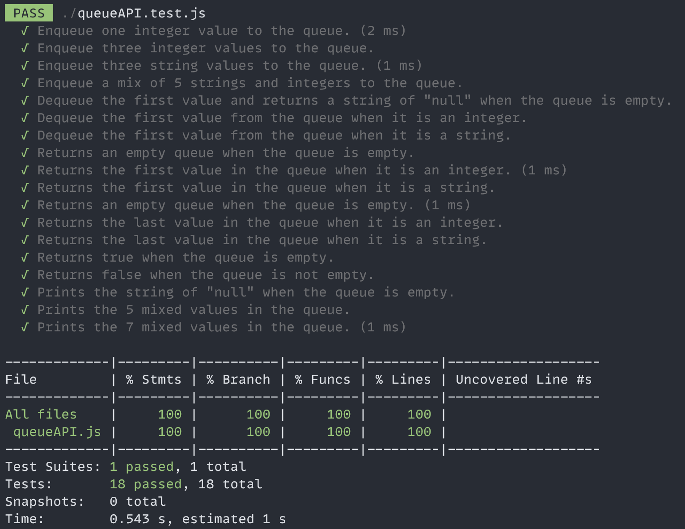

# queue API Project

The queue API project contains the following methods along with its respective unit tests written using JEST.

- enqueue: pushes a value into the queue
- dequeue: removes the first value from the queue
- firstValueInQueue: returns the first value in the queue
- lastValueInQueue: returns the last value in the queue
- isEmpty: returns a boolean of whether the queue is empty
- printValuesInQueue: prints all the values in the queue

