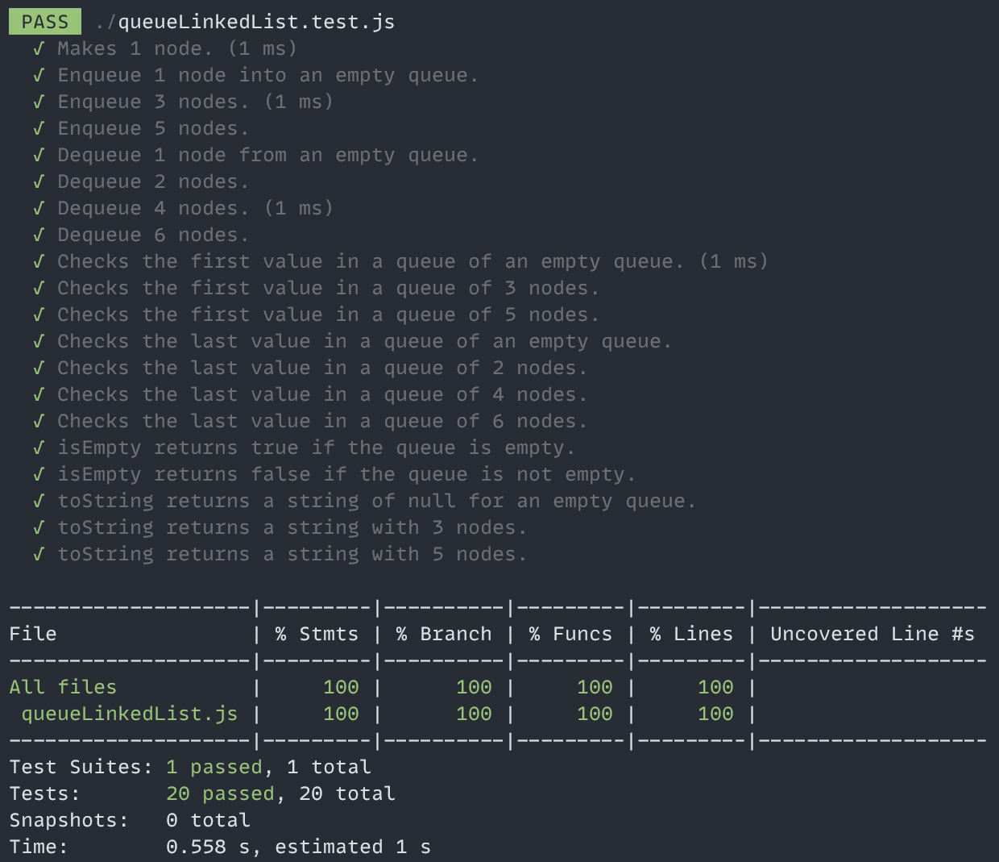

# The Queue Linked List Project

The Queue Linked List API project implements a linked list queue API. The Queue class uses a linked list of nodes to implement the following methods:

- enqueue: adds a node to the end of the queue.
- dequeue: removes a node from the front of the queue.
- firstValueInQueue: returns the first value in the queue.
- lastValueInQueue: returns the last value in the queue.
- isEmpty: returns a boolean if the queue is empty.
- toString: returns a string of the values in the queue.

