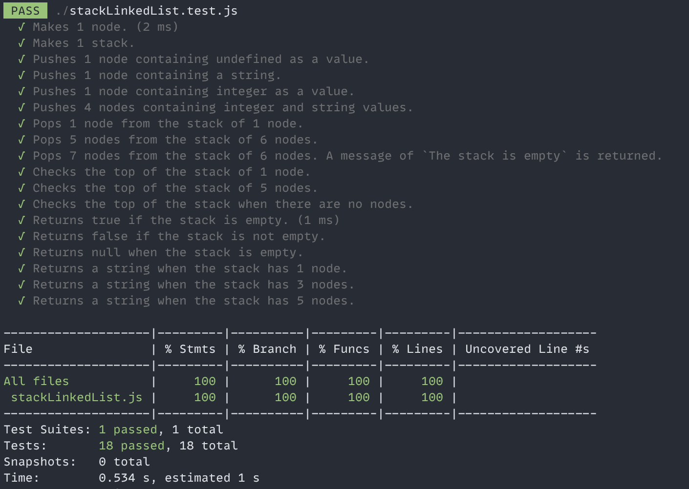

# The Stacked Linked List Project

The Stack class uses nodes to implement the following methods:

- push: pushes a node to the Stack and sets the next node.
- pop: pops a node from the Stack.
- isTop: returns the value of the top of the Stack.
- isEmpty: returns a boolean of whether the Stack is empty.
- toString: returns a string of all the values in the Stack.



---

# Postmortem #6 - stackedLinkedList Project

I made the Stacked Linked List mini project more complicated than it should have been!

I was implementing a stack using an array _*and*_ I tried to make it a linked list using the .getNext method of the Node class. It wasn't suppose to be like that at all! 🐭🪤

I was seeing the following and it should have been enough to ring some bells! 🧠🔔

```
 Expected: undefined
    Received: {"_head": {"_next": {"_next": {"_next": null, "_value": 5}, "_value": 7}, "_value": 9}, "_oldHead": null, "_stack": []}
```

I was seeing that object when I was accessing the head of the linked list. I should have stopped myself right then and there to fix the push and pop method. I was implementing something completely wrong! The implementation got convoluted so I ended up starting over. The second time implementing the code took 30 minutes and the unit tests took 45 minutes to write. Next time around, I will MAKE SURE that the methods work _before_ moving on to the unit tests.

Bugs were being exposed by the .toString method as I created more nodes and popping them from the stack. I had to try to find the root cause. These bugs are like having a cockroach breeding under the kitchen cupboard. I don't know that it's there until it's too late! 🪳
